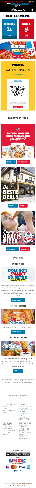

# Procesverslag
Markdown is een simpele manier om HTML te schrijven.  
Markdown cheat cheet: [Hulp bij het schrijven van Markdown](https://github.com/adam-p/markdown-here/wiki/Markdown-Cheatsheet).

Nb. De standaardstructuur en de spartaanse opmaak van de README.md zijn helemaal prima. Het gaat om de inhoud van je procesverslag. Besteedt de tijd voor pracht en praal aan je website.

Nb. Door *open* toe te voegen aan een *details* element kun je deze standaard open zetten. Fijn om dat steeds voor de relevante stuk(ken) te doen.

## Jij

  
uitwerken voor kick-off werkgroep

  ### Auteur:
  Ruud Jansen

  #### Je startniveau:
  Rood

  #### Je focus:
  Responsive
 

## Je website

  
uitwerken voor kick-off werkgroep

  ### Je opdracht:
  https://www.site-improvement.nl/

  Ik heb gekozen om mijn vader zijn bedrijfs website/portfolio na te maken. Ik heb hem hier vaak genoeg aan zien werken en meestal kwam het klungelig en onpraktisch over. Deze website heeft hij gemaakt en onderhoudt hij met een CMS. Dit kan natuurlijk super handig zijn voor mensen die niet heel verstand hebben van    het daadwerkelijk zelf coderen maar je wordt wel enorm in je vrijheid beperkt. Op mijn vaders website staan bijvoorbeeld nog steeds ingebouwde knopppen die linken naar de shop pagina waar je dit thema kan kopen, niet ideaal dus. 
  
  Ik zag dit als een challenge om het beter (en goedkoper) te doen. Geen gehannes met drag and drop of bepaalde functies waar je weer extra voor moet betalen.

  Met deze opdracht wil ik mezelf wat meer trainen in het responsive maken. Ik wil dat de website er zowel op mobiel als laptop er top uitziet. Verder wil ik ook oefenen met de meer "flashy" onderdelen zoals de carousels, animaties, dingen die veranderen, een website die zich aanpast aan het scherm, etc.

  Mijn vader was in ieder geval erg onder de indruk over wat ik in een korte periode heb kunnen doen aangezien hij hier maanden mee bezig is geweest (en nog steeds is). En dat nog wel voor iemand die werkt in de IT

  #### Screenshot(s) van de eerste pagina (small screen): 
  Homepagina  
  

  #### Screenshot(s) van de tweede pagina (small screen):
  Menupagina  
  
 

## Toegankelijkheidstest 1/2 (week 1)

  
uitwerken na test in 1e werkgroep

  ### Bevindingen
  Lijst met je bevindingen die in de test naar voren kwamen:

  Ik heb deze test met Ruby gedaan.

  #### Screenreader
  Hier korte omschrijving (met indien nodig afbeeldingen)
  De screenreader kwam eigenlijk wel redelijk goed door de website heen maar er waren zeker een paar struikelpunten:
  - De manier waarom mijn hader elke titel heeft opgesplits in losse stukjes tekst bracht de screenreader nogal in de war. De teksten kwamen er raar en in een onverwachtse volgorde uit. De oplossing hiervoor is eigenlijk simpel: semantische opbouw. Geen h2 gebruiken omdat je de styling goed vind maar gewoon het correcte element en de styling zelf aanpassen indien nodig.
  - Helemaal bovenaan is een soort carousel/animatie te vinden. Deze laat telkens een paar seconden wat tekst zien en gaat dan door naar de volgende. Hierdoor heeft de screenreader (afhankelijk van de ingestelde snelheid) niet altijd genoeg tijd om te teks voor te lezen voor hij verdwijnt en op display none wordt gezet. Ik ben er ook nog niet helemaal uitgekomen wat hier de beste oplossing voor is. Ik heb geprobeerd de tijd wat te verlengen maar het is moeilijk om tekst die telkens verplaatst om nieuwe ruimte te maken voor te laten lezen.
  

  #### Muis en Toetsenbord 
  Hier korte omschrijving (met indien nodig afbeeldingen)
  - Op mijn vaders website staan een helebool overbodige "knoppen"/A elementen die het navigeren onnodig veel vertragen.
  - Er zit bijna nergens een focus state op waardoor je 9/10 keer niet eens kan zien waar de cursor op dit moment is behalve door het kleine link balkje linksonderin het scherm te lezen

  De meest simpele manier om dit op te lossen is door niet alles klikbaar te maken en gewoon een focus state toe te voegen. Op deze manier kan een gebruiker sneller navigeren en ook zien wat er gebeurd op het scherm.
 

  #### Visueel (brillen, contrast, kleurenblind, dark/light). 
  Hier korte omschrijving (met indien nodig afbeeldingen)
  - De website zag er eigenlijk prima uit, welliswaar heel dof met sommige instellingen. Het contrast kan soms iets te laag liggen waardoor je als gebruiker de test wat minder goed kan lezen.

## Toegankelijkheidstest 2/2 (week 4)

  
uitwerken na test in 8e werkgroep

  ### Bevindingen
  Lijst met je bevindingen die in de test naar voren kwamen (geef ook aan wat er verbeterd is):

  #### Screenreader
  Ik heb het verloop van de screenreader kunnen verbeteren door de tijd van de carousels te verlengen, minder klikbare elementen te hebben en aria labels toe te voegen. Voor de dingen die misschien wat minder belangrijk zijn maar wel informatie bevatten kan het handig zijn om bijvoorbeeld een aria-label toe te voegen in de html. Hiermee help je de screenreader door gewoon te vertellen wat het is bijvoorbeeld. Dankzij de betere focus state kan de gebruiker nu ook beter volgen waar de screenreader is bijvoorbeeld.

  #### Muis en Toetsenbord 
  Zoals ik net al zei kan je als gebruiker nu tenminste zien waar je heen aan het navigeren bent. Het is geen blinde gok meer wat er is nu een duidelijke en zichbare focus die je over de elementen ziet bewegen.

  #### Visueel (brillen, contrast, kleurenblind, dark/light). 
  Hier heb ik niet echt verbeteringen kunnnen toevoegen. Ik heb wel grprobeerd het contrast wat te verhogen en de teskst groter te maken om de tekst beter leesbaar te maken in de uitzonderlijke gevallen.

## Eindgesprek (week 5)

  
uitwerken voor eindgesprek

  ### Je uitkomst - karakteristiek screenshots:
  Ik ben blij met het resultaat. Helaas is niet alles gelukt. Ik zou nog wel 100 dingen toe willen voegen maar ik heb op sommige onderdelen ontzettend lang vast gezeten wat ten koste ging van mijn kostbare tijd voor de andere leuke dingen. Ik vind het knap van mezelf dat ik toch een website heb na kunnen maken van een CMS, ookal zijn die over het algemeen vaak wat simpeler. Ik heb alles zelf moeten uitvogelen en helaas geen drag and drop mogelijkheid.

Ik wil binnenkort de website nog een keer opnieuw beginnen omdat ik tegen het eind van de opdracht gewoon scheel begon te zien van alle regels css. Vaak overlapte deze elkaar ook waardoor er ineens iets onverwachts gebeurde waar ik vervolgens weer super veel tijd en energie in heb gestoken. Het zou mij ook super leuk lijken om dit echt als baan te doen maar dan ook leuke prive projectjes waar ik zelf alles mag bepalen.

  ### Dit ging goed/Heb ik geleerd: 
  Ik denk dat ik het meest verrast en opgelucht ben over het klanten overzicht. Ik heb uren naar mijn scherm zitten te staren, honderden dingen geprobeerd tot er ineens iets werkt en de oplossing gevonden bleek te zijn.

  ### Dit was lastig/Is niet gelukt:
  Ik had nog heel vraag de filter van de kl;anten willen maken. Ik ben er al lang mee bezig geweest maar het lukte telkens toch niet. als ik nou een paar dagen extra gehad ziu hebben van zou het mij wel lukken denk ik. Ik ben een paar keer in de buurt gekomen met oplossingen maar die bleken achteraf dan toch wat minder praktisch en goed te werken dan ik dacht.

  

